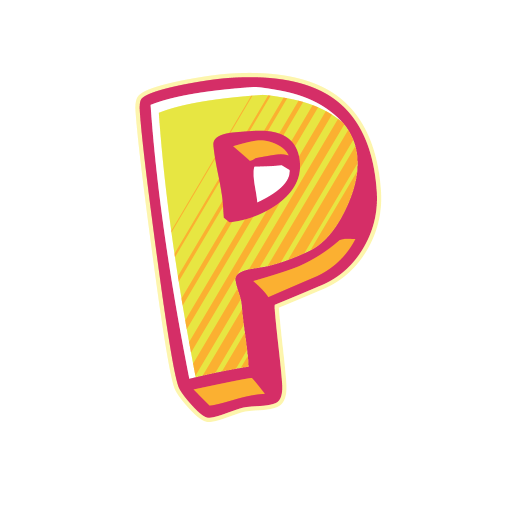

# Pixel Junior for Flathub

## About

**Pixel Junior** is the official companion app for the "Pixel Computer Science and Engineering" textbook, designed to support both students and teachers in learning computer science.

With a simple and intuitive interface, users can access interactive activities, educational resources, quizzes, and mini-games that make learning engaging, progressive, and fun.

### Language Support

**Note:** The application interface is currently available in **French** and **English**. Arabic translations are planned and will be added in a future update.

### For Students

Students can:
- Complete interactive learning activities
- Access additional educational resources
- Take quizzes to test their knowledge
- Play educational mini-games
- Complete challenges that encourage critical thinking, creativity, and independence
- Track their learning progress over time

### For Teachers

Teachers have access to the same educational content as students, with the added ability to:
- Access learning materials for every grade level
- Easily switch between grade levels to explore the corresponding content
- Browse activities, quizzes, educational resources, and mini-games to help prepare their lessons
- Enjoy a complete learning experience integrated with the textbook

Pixel Junior is fully integrated with the "Pixel Computer Science and Engineering" textbook, extending learning beyond the classroom. Whether you're a student or a teacher, Pixel Junior provides a complete, interactive, and evolving learning environment that makes computer science more engaging and accessible.

## Key Features

- Interactive learning activities and educational resources
- Engaging quizzes to evaluate knowledge
- Educational mini-games for practicing computer science concepts
- Support for multiple grade levels (for teachers)
- Integrated with the "Pixel Computer Science and Engineering" textbook
- Progressive learning path tailored to the textbook
- Intuitive interface designed for students and teachers
- Branding colors: #FBB031 (light mode) and #FF5E62 (dark mode)

## Project Information

- **Application ID:** `com.almaarijstudios.pxjr`
- **Name:** Pixel Junior
- **Developer:** Al Maarij Edition (`com.almaarijstudios`)
- **Homepage:** https://pixel-junior.com/app/
- **Latest version:** 7.0.0 (released 2026-07-16)
- **License:**
  - Metadata: `CC0-1.0`
  - Application: `LicenseRef-proprietary`

## Screenshots

Screenshots of the application are available on the project website:

- Login screen
- Main application interface
- Interactive activities
- Activities list
- Educational quizzes
- Answer validation (Correct!)

Latest screenshots (version 7.0.0):
- https://pixel-junior.com/screenshots/7.0.0/en/01.png (Login - English)
- https://pixel-junior.com/screenshots/7.0.0/en/02.png (Main Interface - English)
- https://pixel-junior.com/screenshots/7.0.0/en/03.png (Interactive Activities - English)
- https://pixel-junior.com/screenshots/7.0.0/en/04.png (Activities List - English)
- https://pixel-junior.com/screenshots/7.0.0/en/05.png (Educational Quizzes - English)
- https://pixel-junior.com/screenshots/7.0.0/en/06.png (Correct! - English)

French versions are also available by replacing `/en/` with `/fr/` in the URLs.

## This Repository

This repository does not contain the files needed to package **PixelJr** for distribution on Flathub.
It only contains metadata files such as icons.

Packaging and publishing details may depend on the main Flathub manifest (Flatpak manifest) that references these assets.

## Content Rating

Pixel Junior uses the **OARS 1.1** content rating system and is suitable for educational use.
